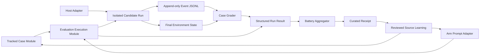

# Harness Innovation Evaluation Design

Date: 2026-07-12
Status: approved design
Implementation plan: [2026-07-12-harness-innovation-sprint.md](../plans/2026-07-12-harness-innovation-sprint.md)
Evidence: [agent harness innovation source ledger](../../../knowledge/sources/2026-07-12-agent-harness-innovation-source-ledger.md)
Maintained synthesis: [agent harness innovation tenets and gap map](../../../knowledge/wiki/agent-harness-innovation-gaps.md)

## Outcome

Deepen `fable-5-skills` from a repository that defines and validates tracked
evaluation cases into one that can produce trustworthy, replayable evidence
about a complete model-harness-environment configuration.

The design retains the current folder-based, Markdown-first, human-reviewed
workflow. It adds deterministic local scripts only where repeated lifecycle and
evidence logic now passes the deletion test.

## Baseline

The current repository already provides:

- a compact always-loaded `fable-task-harness/SKILL.md` spine;
- trigger-gated operational references;
- root and stage routing contracts;
- frozen control, harness, and full-load arm prompts;
- a repeated-run, blind-scoring protocol;
- one tracked trap case with prompt, fixture, manifest, grader, tests, and receipt;
- deterministic package and case validators.

Current verification at the design cutoff:

- 24 case-validator tests passed;
- 14 Decoy Config grader tests passed;
- `python scripts/check-eval-cases.py` passed;
- `python scripts/check-skill-package.py` passed;
- `git diff --check` exited zero with line-ending warnings only;
- a read-only scan found no broken relative Markdown links.

The current case receipt acknowledges that it cannot reconstruct its historical
battery because prompt, fixture, grader, harness, model, and environment
fingerprints were not generated by a runner.

## Goals

1. Make every durable evaluation claim traceable to tracked inputs and a curated
   receipt.
2. Enforce case, grader, metadata, and result contracts mechanically.
3. Assemble and prepare repeated A/B/C batteries from tracked case Modules.
4. Capture provenance-tagged observable events available from the host and
   operating system without requiring private reasoning.
5. Grade final state, consequential process behavior, budgets, and boundaries.
6. Test recovery, compaction, approvals, dynamic tools, fault tolerance, and
   long-horizon work.
7. Separate public regression cases from rotating held-out capability cases.
8. Enable cross-host comparison only after two concrete host Implementations
   demonstrate a real Seam.

## Non-Goals

- Replace the Markdown control plane with a workflow framework.
- Add Temporal, DBOS, Prefect, Restate, Logfire, or OpenTelemetry as a mandatory
  dependency.
- Record or grade hidden chain-of-thought.
- Reward multi-agent orchestration merely for being present.
- Treat an LLM judge as authoritative without human calibration.
- Publish GitHub issues, commit, push, or open a pull request as part of this
  evidence-pack task.
- Rewrite the shipped harness before new cases demonstrate a repeated behavior
  gap.

## Operating Contract

| Concern | Decision |
|---------|----------|
| Source of truth | Tracked case Modules, versioned schemas, frozen prompts, deterministic graders, curated receipts |
| Generated evidence | `evals/runs/`; local and ignored unless a curated artifact is explicitly promoted |
| Allowed implementation | Standard-library evaluation runtime using JSON, JSONL, Markdown, and `unittest`; `PyYAML==6.0.3` and `jsonschema==4.26.0` for validation; optional host/OTel Adapters later |
| Human role | Approve judgment-heavy criteria, blind-score open-ended artifacts, calibrate judges, accept promoted findings |
| Agent role | Prepare deterministic runs, capture evidence, execute graders, aggregate metrics, propose source improvements |
| Stop points | Host Adapter selection, held-out storage policy, external credentials, destructive or external eval actions |
| Completion proof | Tests, schema validation, replayable fingerprints, full residual diff, tracked receipts |

## Architecture



### Existing Module: Tracked Evaluation Case

Location: `evals/cases/<case-id>/`

Interface:

- `case.json` declares identity, version, kind, immutable inputs, grader command,
  ground truth, and receipts;
- `prompt.md` is the frozen task prompt;
- `fixture/` is the pristine starting state;
- `grader.py` consumes one completed run and emits a structured result;
- `test_grader.py` proves accepted and rejected outcomes;
- `receipts/` preserves durable conclusions and limitations.

The Module remains case-specific. Shared behavior is extracted only after at
least two materially different graders repeat it.

### New Module: Evaluation Execution

Proposed location: `scripts/evals/`

Command Interface:

```text
python scripts/run-eval.py prepare --case <id> --arm <arm> --run-dir <path>
python scripts/run-eval.py grade --run-dir <path>
python scripts/run-eval.py summarize --battery-dir <path>
```

The first Implementation may prepare and ingest manually executed host runs. It
does not need to launch every vendor runtime. It owns deterministic bookkeeping:

1. validate case and selected arm;
2. create an isolated run folder from the exact fixture;
3. assemble arm and case prompts verbatim;
4. record immutable fingerprints;
5. write machine-readable initial metadata;
6. expose the host command or task packet;
7. ingest host events and final state;
8. invoke the declared grader without allowing candidate mutation of grader or
   ground truth;
9. emit structured result and receipt inputs;
10. preserve failed runs for inspection according to lifecycle policy.

Imported telemetry retains its provenance. Runner-observed operating-system and
tool-result events are primary observable evidence; host-reported, worker-supplied,
and derived records remain usable but are never relabeled as independently
observed facts. Missing host capabilities are recorded explicitly.

Evidence admissibility follows a trust matrix:

| Provenance | Admissible use |
|------------|----------------|
| `runner_observed` | May prove objective or consequential process facts only inside the runner's declared observation boundary |
| `host_reported` | May prove only capabilities declared and contract-tested by that host Adapter; otherwise it is corroborative |
| `worker_supplied` | Human-readable context only; never sole proof of success, safety, permissions, usage, budgets, or boundaries |
| `derived` | Must name input event IDs/hashes plus algorithm/version and inherits the least-trusted input; derivation never upgrades trust |

Simulation is a separate environment marker, not a stronger provenance class.
Every simulated event records `environment_kind: simulated`; manual versus
streaming ingestion is also explicit.

Deletion test: removing this Module would duplicate assembly, hashing, fixture,
metadata, grading, and receipt logic in every case and arm. The Implementation
therefore provides Depth, Leverage, and Locality behind a small Interface.

### New Module: Run Evidence

Proposed files:

```text
evals/schemas/case.schema.json
evals/schemas/run-meta.schema.json
evals/schemas/trace-event.schema.json
evals/schemas/run-result.schema.json
evals/schemas/receipt.schema.json
scripts/evals/evidence.py
```

Responsibilities:

- parse and validate versioned artifacts;
- require UTC or offset-aware ISO timestamps and valid ordering;
- maintain run, checkpoint, parent-agent, tool-call, and approval lineage;
- normalize counts without trusting worker prose;
- validate token syntax and distinguish unavailable metrics from zero;
- redact secrets; when correlation is necessary, use keyed per-battery HMAC
  tokens with a non-exported, rotatable key, otherwise omit the digest;
- reject unknown required schema versions;
- preserve forward-compatible optional fields.

Deletion test: the same rules already appear in the protocol, Decoy grader,
worker metadata, and reviews. Centralizing them produces real Leverage.

### Existing Seam: Arm Prompts

The control, harness, and full-load prompts are three real Adapters. The runner
must treat their files as immutable inputs and record their content hashes.

Add a bounded-checkpoint arm only as an explicit experiment. It must not silently
replace one of the existing arms or be described as a new product mode.

### Future Seam: Host Runtimes

Candidate hosts include Codex, Claude Code, Cursor, and OpenCode. The first host
Implementation stays direct. After a second host works, extract the common
Adapter Interface from observed differences in:

- prompt/task injection;
- workspace isolation;
- event export;
- approvals and permission outcomes;
- token and cost reporting;
- compaction and continuation;
- subagent identity and cancellation;
- terminal state and error mapping.

One Adapter is a hypothetical Seam. Two working Adapters make it real.

Before a real host is selected, policy-dependent conformance cases run through a
deterministic local simulated-host Implementation. Its events are labeled
simulated and cannot support a claim about Codex, Claude Code, Cursor, OpenCode,
or any other real host. The first real host must replay applicable conformance
scenarios and report unsupported interception capabilities.

### Optional Adapters

- OpenTelemetry span import/export;
- Claude Code hooks;
- Cursor hooks;
- OpenCode plugin events;
- Codex App Server or SDK events;
- durable workflow engines.

None of these formats becomes canonical. Each maps into the local event and run
result contracts.

## Data Contracts

### Case Manifest Version Next

The next manifest revision should add optional, validator-backed sections before
they become required:

```json
{
  "environment": {
    "platforms": ["windows", "linux"],
    "timezone": "UTC",
    "frozen_time": null,
    "seed": 0,
    "network": "deny",
    "reset_command": ["python", "reset.py"]
  },
  "budgets": {
    "max_wall_seconds": 900,
    "max_model_requests": null,
    "max_tool_calls": null
  },
  "boundaries": {
    "read_roots": ["workdir"],
    "write_roots": ["workdir/output"],
    "protected_paths": ["workdir/ground-truth"],
    "external_systems": "deny"
  },
  "state_deltas": {
    "required": [],
    "allowed": [],
    "forbidden": []
  },
  "freshness": {
    "tier": "regression",
    "source_date": "2026-07-12",
    "retire_after": null
  }
}
```

Exact field names are finalized test-first during implementation. The example
states semantics; it is not permission to add untested fields wholesale.

### Run Metadata

Required groups:

- identity: case, case version, arm, repetition, harness, model, host Adapter;
- fingerprints: case prompt, arm prompt, fixture, grader, harness, environment;
- timing: prepared, started, ended, duration source;
- usage: model requests, input/output/cached tokens, tool calls, retries, cost;
- lifecycle: status, interruption, resume source, checkpoint lineage;
- evidence: trace path/hash, result path/hash, final-state inventory/hash;
- limitations: unavailable telemetry, blocked verification, unverified remainder.

### Trace Event JSONL

Each line is an independently valid event with:

- schema version and monotonic event ID;
- timestamp and duration where known;
- run ID plus nullable session, agent, parent-agent, and checkpoint IDs when the
  telemetry source exposes them;
- provenance (`runner_observed`, `host_reported`, `worker_supplied`, or `derived`)
  and the relevant telemetry-capability marker;
- environment kind (`real` or `simulated`) and ingestion method (`stream`,
  `manual`, or `runner_generated`);
- event type;
- tool/action name and sanitized argument digest;
- cwd or target root where applicable;
- permission decision plus nullable approval request/result IDs where exposed;
- status, exit code, and observation digest;
- token/cost snapshot when exposed;
- redaction markers.

Every completed call and result pair uses a stable ID. An interruption, crash, or
budget stop may leave a call unresolved only when the terminal event lists that
call ID and reason; the runner may append a provenance-tagged closure event but
may not fabricate a host result. Events never require private reasoning text. A
missing optional lineage field is not fabricated; it is paired with an explicit
capability limitation.

### Run Result Envelope

The runner emits the result envelope and owns run validity, terminal status, and
evidence limitations. The grader contributes objective findings only when it
actually runs. The envelope contains:

- schema, case, case version, run, runner, and nullable grader identity;
- terminal status, evidence validity, and score applicability;
- nullable binary primary outcome (`null` only when setup, runner, evidence, or
  grader state makes a candidate score not applicable);
- named objective checks;
- state-delta findings;
- consequential process assertions;
- budget and boundary findings;
- diagnostic milestone scores;
- evidence paths and hashes;
- limitations and grader version.

When the grader ran on valid evidence, its exit `0` contribution means every
required objective assertion passed. The runner maps that contribution into the
envelope and distinguishes objective failure, invalid evidence, setup failure,
grader failure, interruption, and safe budget exhaustion. Non-scorable states do
not become candidate failures. A valid candidate run that exhausts its declared
budget before completion remains score-applicable with primary outcome `false`;
`budget_exceeded` is a distinct terminal status but still counts as an attempted,
unsuccessful trial. Unavailable enforcement, runner failure, or invalid budget
evidence remains non-scorable with a null outcome.

### Curated Receipt

A receipt is generated from structured inputs and then human-reviewed. It
contains:

- exact evaluated configuration;
- repetitions and arm mapping;
- primary outcomes and reliability statistics;
- artifact and process summaries;
- cost and budget evidence;
- deviations, missing telemetry, and validity limits;
- source-learning decisions with target files;
- enough fingerprints and commands to reconstruct the battery.

Raw transcripts and artifacts may remain ignored; the receipt cannot make a
claim that depends only on an unavailable raw run.

## Evaluation Method

### Two Suites

1. **Regression suite:** public tracked cases expected to remain near 100% after
   a behavior graduates.
2. **Capability suite:** rotating held-out or freshly sourced cases expected to
   expose current limits.

Retired capability cases move into the regression suite only after review.

### Scoring Order

1. Validate setup and evidence integrity.
2. Lock immutable original artifacts and create blind-review copies that
   neutralize only enclosing path/arm labels and wrapper metadata; candidate
   output bytes remain identical.
3. Run uniform deterministic objective grader assertions against the immutable
   original run, never a rewritten candidate artifact.
4. Score artifact dimensions from the byte-identical blind copies.
5. Unblind, open process evidence, and score consequential behavior.
6. Aggregate repetitions and disclose uncertainty.
7. Review disagreements, invalid tasks, and grader defects before drawing a
   harness conclusion.

### Metrics

Headline metrics:

- binary success and successes/attempts;
- `pass@1` for first-attempt capability;
- `pass^k`-style all-trials reliability for the chosen repetition count;
- confidence or uncertainty interval appropriate to sample size;
- wall time, model requests, tokens, tool calls, retries, and cost when exposed;
- boundary violations and unsafe attempts;
- residual state changes;
- recovery success and repeated-mistake count.

Milestone or partial-completion scores remain diagnostic and cannot replace the
binary outcome.

## Case Portfolio

The implementation sequence is deliberate:

1. migrate `undocumented-local-tool`;
2. add a tracked build case;
3. prove the runner and evidence contracts on those plus Decoy Config;
4. add recovery and state-delta cases;
5. add permission, approval, injection, and dynamic-tool cases;
6. add long-horizon, interface-ablation, and multi-agent cases;
7. establish held-out capability rotation.

This order prevents a large case catalog from growing on top of an untrusted
runner or grader contract.

## Failure Handling

- Setup failure produces no candidate score and preserves diagnostics.
- Candidate interruption preserves the event prefix and latest durable state.
- Grader failure is distinct from candidate failure.
- Missing process telemetry caps only process assertions unless the task makes
  the path part of correctness or safety.
- Budget exhaustion ends safely and records the limit reached. When enforcement
  and run evidence are valid, it remains a score-applicable unsuccessful trial;
  only unavailable/invalid enforcement evidence makes budget status non-scorable.
- Failed cases may retain their environment for inspection; successful cases may
  clean runner-created temporary artifacts only.
- Tool/system logs are evidence, not cleanup targets.

## Security And Privacy

- Candidate runs cannot write their grader, manifest, ground truth, or pristine
  fixture.
- Boundary profiles apply least privilege and explicit escalation.
- Sensitive input uses an out-of-band approval/elicitation path when required.
- Event capture never stores raw secrets, credentials, or unsalted hashes. When
  within-battery correlation is necessary, it uses keyed HMAC tokens with a
  non-exported, rotated key; otherwise the digest is omitted.
- Untrusted repository, issue, log, document, skill, and tool content remains
  data, not authority.
- Approval IDs and completed side effects survive resume so work is not repeated.

## Acceptance Criteria For The Architecture

The architecture is proven when:

1. at least one build and two materially different trap cases are tracked;
2. case validation rejects incomplete Modules and nonconforming graders;
3. setup can run twice and produce the same initialized-state hash;
4. a prepared run records every required fingerprint;
5. a structured trace is validated without private reasoning;
6. required/allowed/forbidden deltas detect collateral damage while accepting an
   alternate-good solution;
7. a complete current-harness battery produces reconstructable receipts;
8. recovery, approval, and indirect-injection cases each distinguish safe success
   from plausible but unsafe output;
9. the second host Implementation reveals and then validates the host Adapter
   Interface;
10. public regression and held-out capability results are reported separately.

## Approved And Deferred Decisions

Approved:

- local evidence pack and local backlog;
- standard-library core with pinned validation dependencies;
- JSON/JSONL machine contracts paired with Markdown receipts;
- outcome-first grading plus consequential process assertions;
- optional OTel and vendor Adapters;
- multi-sprint implementation sequence.

Deferred to explicit future approval:

- which two host runtimes become the first portable Adapter pair;
- where held-out cases live and who may inspect them;
- any credentialed external-system evaluation;
- GitHub issue publication;
- adding a non-standard runtime dependency.
